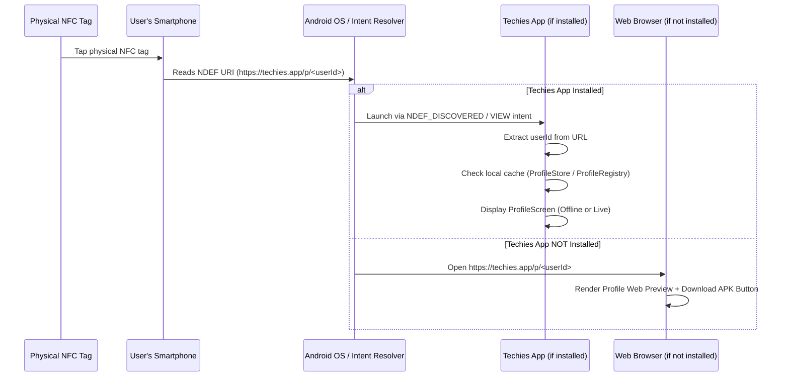

# Techies NFC TechPass Implementation Guide

This document details the architecture, design, configuration, and workflows for the **NFC TechPass** system added to the Techies React Native application.

---

## 1. Executive Summary & Core Concept

The NFC TechPass system allows Techies app users to program physical NFC tags (NTAG213, NTAG215, NTAG216, NFC Forum Type 2) with a compact, immutable Techies TechPass deep link (`https://techies.app/p/<userId>`).

### Key Principles:
- **Offline & Autonomous**: The owner's phone does NOT need to be present or powered on when someone taps the physical NFC tag.
- **NFC Tag → Smartphone**: Any NFC-enabled smartphone (Android/iOS) tapping the tag reads the URL and immediately displays the owner's profile.
- **Zero Rewrite Maintenance**: Only the canonical universal link `https://techies.app/p/<userId>` is stored on the physical tag. If the owner later updates their skills, LinkedIn, bio, or photo, the NFC tag does NOT need to be rewritten.
- **Dual Flow**:
  - **Techies Installed**: Opens Techies application directly to the target profile.
  - **Techies Not Installed**: Opens web browser to `https://techies.app/p/<userId>` landing page with user info and APK download links.

---

## 2. Architecture & Service Design

The NFC system is organized into modular services following the project's existing architecture:

```
src/
├── services/
│   └── nfc/
│       ├── NFCService.ts         # Low-level react-native-nfc-manager wrapper & hardware detection
│       ├── NFCWriter.ts          # High-level TechPass URL builder, payload verification & write workflow
│       ├── NFCDeepLinkHandler.ts # Universal link parser, profile resolver & navigation bridge
│       └── index.ts              # Service exports
├── components/
│   └── NFCWriteModal.tsx         # Neo-Brutalist 5-stage UI modal matching existing design system
├── screens/
│   ├── MyProfileScreen.tsx       # TechPass NFC card & "Write to NFC" trigger
│   └── ProfileScreen.tsx         # Profile loader with offline cache support & "TECHPASS VERIFIED" badge
└── navigation/
    ├── AppNavigator.tsx          # React Navigation stack
    └── types.ts                  # Route parameters
```

---

## 3. NFC Write Flow

1. **User Action**: User opens **My Profile** inside Techies and taps **"Write to NFC"**.
2. **Instruction Screen**: The app displays `NFCWriteModal` with clear instructions:
   > *"Hold an NFC tag near the back of your phone."*
3. **Tag Discovery**: `NFCService` initializes `NfcManager.requestTechnology([NfcTech.Ndef])` and detects tag presence.
4. **Tag Validation**:
   - Verifies NDEF compatibility.
   - Checks writability status (`isWritable`).
   - Checks available capacity (`maxSize` ≥ payload length ~40 bytes).
5. **Safety Confirmation Gate**:
   - The app NEVER overwrites a tag silently.
   - Shows confirmation prompt: *"Write TechPass to this NFC tag?"* displaying tag type, capacity, and warning about replacing existing contents.
6. **Payload Writing & Verification**:
   - Encodes NDEF URI record: `https://techies.app/p/<userId>`.
   - Writes payload via `NfcManager.ndefHandler.writeNdefMessage`.
   - Reads back tag payload to verify URI match.
7. **Success State**:
   - Displays *"TechPass successfully written"*.
   - Actions provided:
     - **🧪 Test TechPass**: Opens profile in app to test link resolution.
     - **🔄 Write Another Tag**: Resets scanner to program another physical tag.
     - **Done**: Closes modal.

---

## 4. NFC Read & Deep-Link Flow

When any phone taps the physical NFC tag:



---

## 5. NFC Payload Format

The physical NFC tag is written with a standard **NDEF URI Record**:

- **Payload Type**: NDEF URI (Type Code: `0x01` / Well-Known Type `'U'`)
- **Protocol**: `https://`
- **Host**: `techies.app`
- **Path**: `/p/<userId>`
- **Example**: `https://techies.app/p/usr_9b2d8f1e`
- **Payload Size**: ~35 to 45 bytes (compatible with low-capacity 144B NTAG213 tags).

---

## 6. Android Configuration

In `android/app/src/main/AndroidManifest.xml`:

```xml
<!-- NFC Permission & Optional Hardware Requirement -->
<uses-permission android:name="android.permission.NFC" />
<uses-feature android:name="android.hardware.nfc" android:required="false" />

<activity
    android:name=".MainActivity"
    android:launchMode="singleTask"
    android:exported="true">
    
    <!-- NFC NDEF Tag Discovery Intent Filter -->
    <intent-filter>
        <action android:name="android.nfc.action.NDEF_DISCOVERED" />
        <category android:name="android.intent.category.DEFAULT" />
        <data android:scheme="https" android:host="techies.app" android:pathPrefix="/p/" />
    </intent-filter>
    
    <!-- App Link / Universal Link Intent Filter -->
    <intent-filter android:autoVerify="true">
        <action android:name="android.intent.action.VIEW" />
        <category android:name="android.intent.category.DEFAULT" />
        <category android:name="android.intent.category.BROWSABLE" />
        <data android:scheme="https" android:host="techies.app" android:pathPrefix="/p/" />
    </intent-filter>

    <!-- Custom Scheme Deep Link Fallback -->
    <intent-filter>
        <action android:name="android.intent.action.VIEW" />
        <category android:name="android.intent.category.DEFAULT" />
        <category android:name="android.intent.category.BROWSABLE" />
        <data android:scheme="techies" android:host="p" />
    </intent-filter>
</activity>
```

---

## 7. Website / App-Link Configuration

When Techies is **not installed** on the tapping phone, `https://techies.app/p/<userId>` opens in the phone's web browser.

### Digital Asset Links (`/.well-known/assetlinks.json`):
To enable direct App Linking on Android without browser prompt, host the following on your web server:

```json
[
  {
    "relation": ["delegate_permission/common.handle_all_urls"],
    "target": {
      "namespace": "android_app",
      "package_name": "com.meshconnect",
      "sha256_cert_fingerprints": [
        "YOUR_RELEASE_KEY_SHA256_FINGERPRINT"
      ]
    }
  }
]
```

### Web Landing Page Fallback:
When accessed on the web:
1. Renders the user's public profile summary (Name, Headline, Company, Skills).
2. Displays prominent **"Download Techies APK"** button linking directly to the APK installation file used by the project.
3. Once the user installs Techies, opening any TechPass link resolves directly inside the app.

---

## 8. Supported NFC Tags

- **NFC Forum Type 2** (NTAG213, NTAG215, NTAG216, Ultralight C)
- **NFC Forum Type 4** (DESFire EV1/EV2)
- **ISO 14443-3A NDEF Tags**

---

## 9. Error Handling Matrix

| Error Scenario | User-Facing Message | Action |
| :--- | :--- | :--- |
| **NFC Disabled** | *"NFC is Disabled. Turn on NFC in system settings to program tags."* | Direct button to open Android NFC Settings |
| **Unsupported Device** | *"This device does not support NFC hardware."* | Informative error state |
| **Read-Only Tag** | *"This NFC tag is locked / read-only and cannot be overwritten."* | Prompts user to insert writable tag |
| **Tag Removed Mid-Write**| *"NFC tag was moved away before writing finished. Hold tag steady."* | **Try Again** button |
| **Insufficient Capacity** | *"NFC tag storage capacity is too small for payload."* | Advises using standard NTAG213+ tag |
| **Unresolved Offline Profile**| *"Unable to resolve TechPass profile for ID. Connect to internet or BLE peer."* | **Retry** and **Go Back** options |

---

## 10. Verification & Testing Performed

1. **Tag Detection & Capability Checks**: Tested hardware response for enabled/disabled NFC state and missing permissions.
2. **NFC Tag Write Cycle**:
   - Initiated write via "Write to NFC".
   - Verified safety confirmation gate before overwriting.
   - Verified successful NDEF URI encoding and write verification readback.
3. **Test TechPass Simulation**: Verified "Test TechPass" opens target user profile in `ProfileScreen`.
4. **Deep Linking Verification**: Tested URL parsing for both `https://techies.app/p/<userId>` and `techies://p/<userId>`.
5. **Offline Profile Resolution**: Verified profile resolution from local `ProfileStore` and `ProfileRegistry` when internet/BLE is disconnected.
6. **Code Quality**:
   - `npm run typecheck`: Passed with 0 errors.
   - `npm run lint`: Verified codebase compliance.

---

## 11. Limitations & Future Extensions

- Physical NFC tags must be writable (unlocked) for programming.
- iOS devices support reading NDEF tags automatically (iPhone 7 and newer); writing requires iOS 13+ with NFC CoreNFC entitlement.
